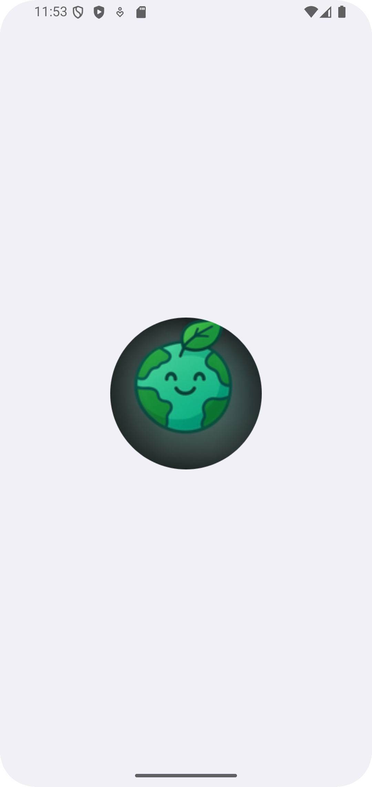
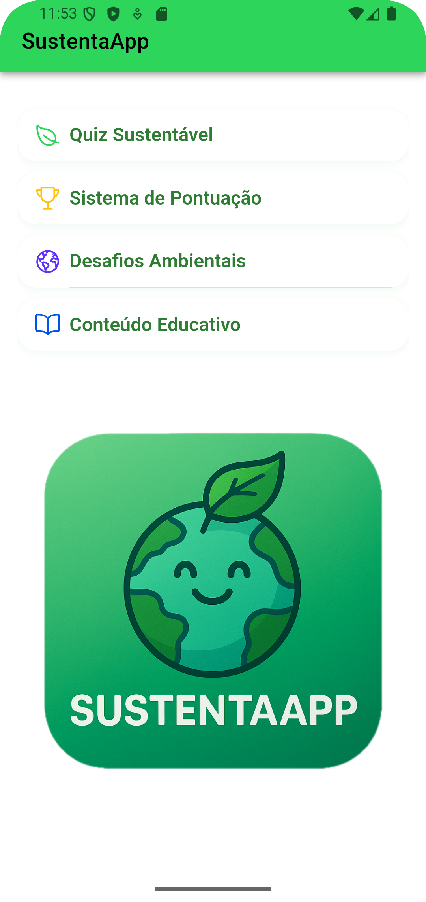
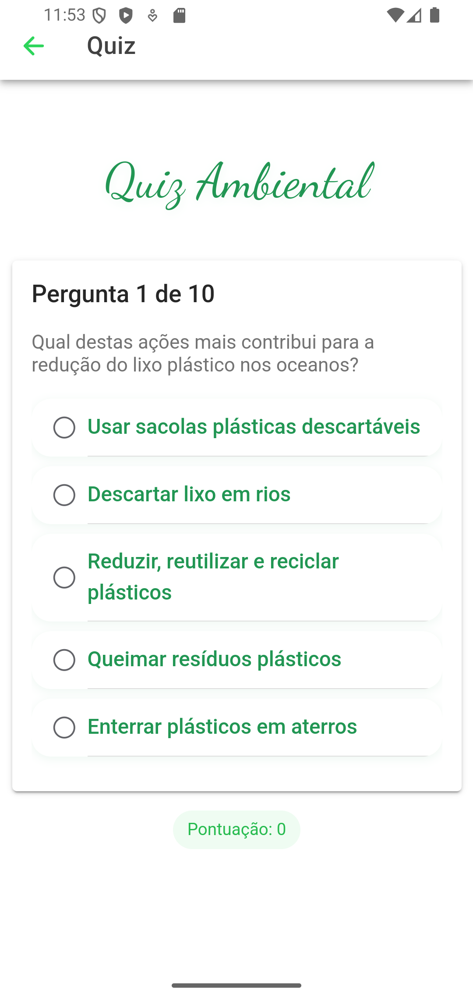
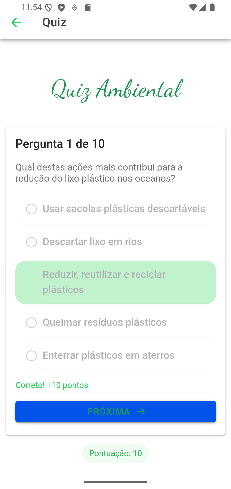
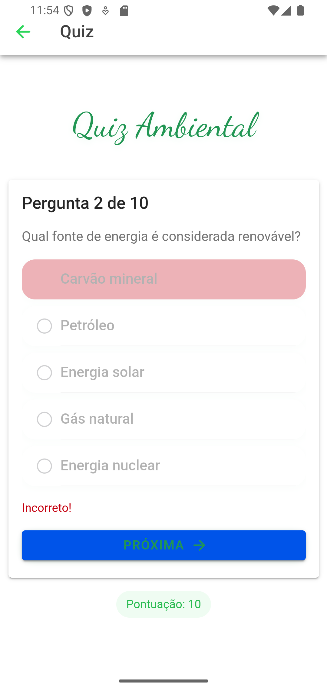

# 🌱 SustentaApp

Aplicativo educativo sobre sustentabilidade, com quizzes interativos, desafios ambientais e gamificação, desenvolvido com Ionic/Angular.

## 📱 Visão Geral

O **SustentaApp** tem como objetivo promover a educação ambiental de forma acessível e divertida para o público geral. Através de quizzes, desafios diários e gamificação, o aplicativo estimula hábitos sustentáveis e amplia a conscientização sobre consumo responsável e meio ambiente.

> 🔗 Alinhado aos Objetivos de Desenvolvimento Sustentável (ODS) da ONU:
- **ODS 4**: Educação de Qualidade  
- **ODS 6**: Água Potável e Saneamento  
- **ODS 7**: Energia Limpa e Acessível  
- **ODS 12**: Consumo e Produção Responsáveis  
- **ODS 13**: Ação Contra a Mudança Global do Clima  
- **ODS 14**: Vida na Água  
- **ODS 15**: Vida Terrestre

## 🚀 Tecnologias Utilizadas

- [Ionic Framework](https://ionicframework.com/)
- [Capacitor](https://capacitorjs.com/)
- HTML5 + CSS3 + TypeScript
- [Angular](https://angular.io/)

## 🧩 Funcionalidades

- 📊 **Quiz Sustentável** – Perguntas sobre temas ambientais com feedback imediato e visual moderno
- 🏅 **Sistema de Pontuação** – Pontos por acertos, ranking local (top 10) e histórico de desempenho
- 🌎 **Desafios Ambientais** – Desafio ecológico diário baseado nas ODS, com histórico e gamificação
- 📚 **Conteúdo Educativo** – Dica ambiental do dia, resumo da Wikipedia e imagem temática
- 🔄 **Gamificação** – Progresso, feedback visual, medalhas simbólicas e incentivo à participação

## 🎯 Público-Alvo

- Jovens e adultos interessados em práticas sustentáveis
- Professores e educadores ambientais
- Comunidades locais e instituições de ensino

## 📦 Instalação e Execução

```bash
# Clone o repositório
git clone https://github.com/davijaf/sustentaapp.git

# Acesse a pasta
cd sustentaapp

# Instale as dependências
npm install

# Execute no navegador
ionic serve

# Para rodar no dispositivo
ionic capacitor add android
ionic capacitor run android
```

### 📲 Instale o APK diretamente

O arquivo APK gerado está disponível em:

```
app-debug.apk
```

Basta transferir para seu dispositivo Android e instalar normalmente.

## 💡 Diferenciais

- Interface moderna, responsiva e acessível
- Integração com APIs públicas (Wikipedia, ODS/ONU)
- Desafios diários alinhados aos Objetivos de Desenvolvimento Sustentável
- Ranking local e histórico de participação
- Totalmente offline para quizzes e desafios

## 📸 Screenshots

<p align="center">
  
  
  
  
  
</p>

---

Desenvolvido por Davi José Araújo Filho — 2025